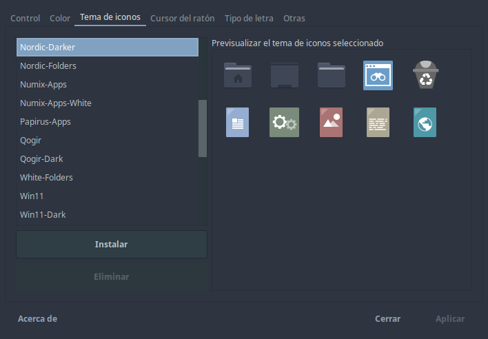
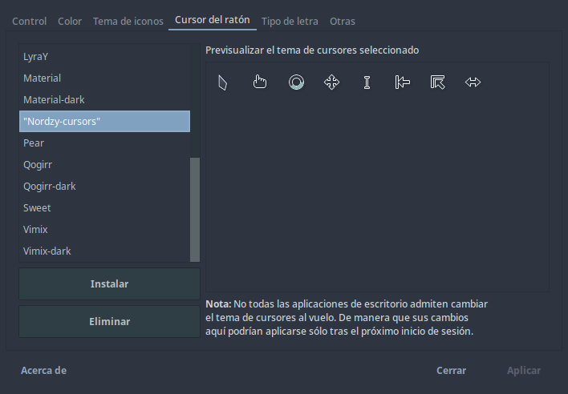
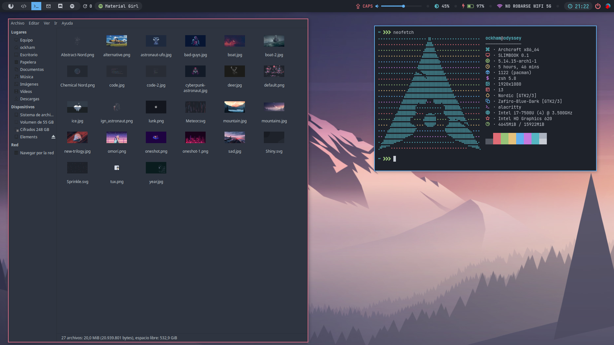
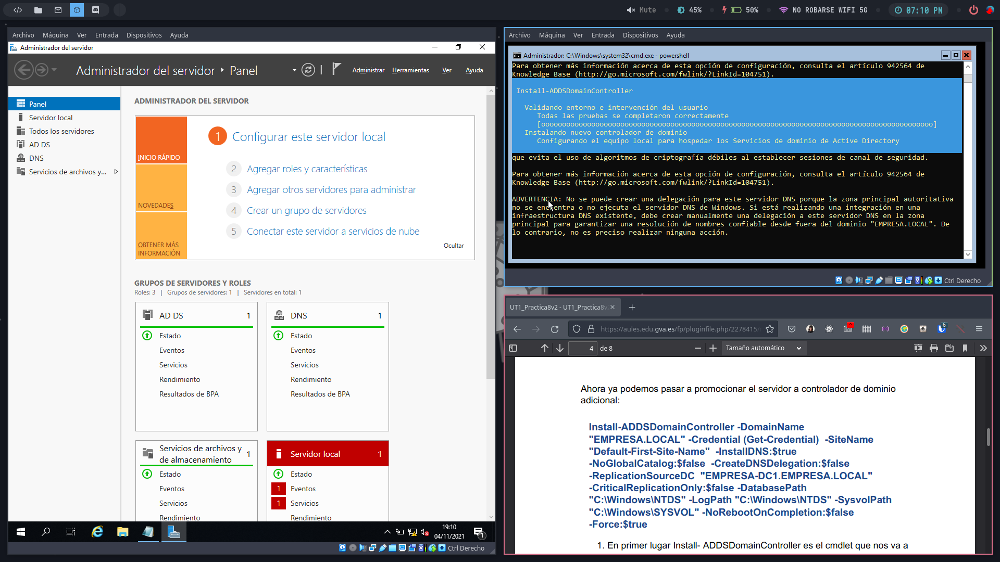
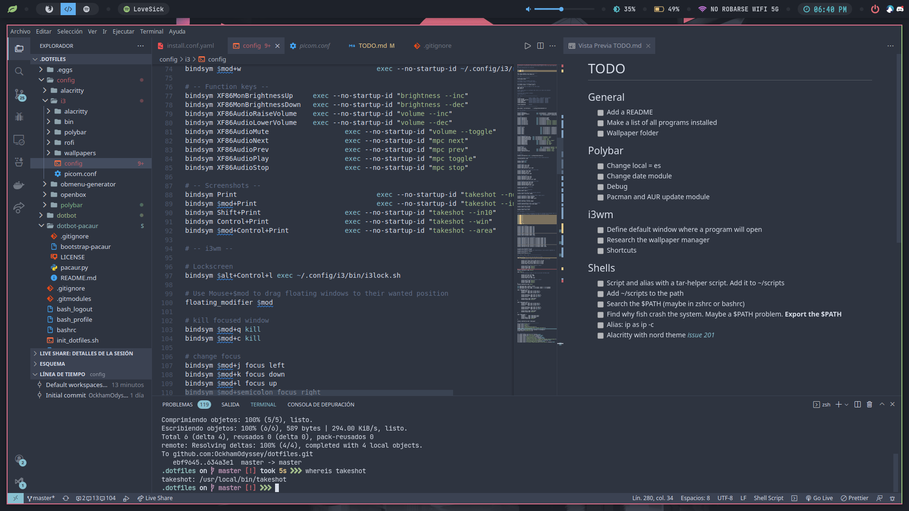

# Archcraft dotfiles
These dotfiles have been made for Archcraft, a distribution based on Archlinux, and with i3wm and openbox desktops.

## Icons
* **Folders**: Nordic-Darker-mod (Nord folders with zafiro apps icons) 
* **Cursors**: Nordzy-cursors 

## Installation
Use this command to install everything:
```
./dotbot/bin/dotbot -p dotbot-yay/yay.py -c install.conf.yaml
```
## Screenshots


